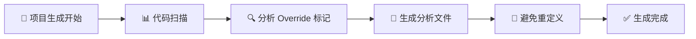

import Tabs from '@theme/Tabs';
import TabItem from '@theme/TabItem';

# 🔄 函数覆盖

## 📝 概述

通过函数覆盖机制，您可以使用 **C#** 重写标记有 `BlueprintImplementableEvent` 或 `BlueprintNativeEvent` 的 C++ 和蓝图函数逻辑，实现灵活的自定义行为。

:::warning ⚠️ 重要提醒：UE5.5 兼容性变更

从 **UE5.5** 开始，Epic Games 对 C++ 类的 `BlueprintNativeEvent` 函数进行了架构调整。因此，插件从 UE5.5 版本开始不再支持覆盖 C++ 类的 `BlueprintNativeEvent` 函数。

📖 详细信息请参考：[UHT 代码生成变更](https://github.com/EpicGames/UnrealEngine/commit/9a428198ab8616a896de16f110caf09491a8ece9)

:::

---

## 🛠️ 实现步骤

### 第一步：创建 Partial 类

使用 C# 的 [Partial 类](https://learn.microsoft.com/en-us/dotnet/csharp/programming-guide/classes-and-structs/partial-classes-and-methods) 机制，为目标函数所属的类创建一个 Partial 类，并添加 `[Override]` 特性标记。

### 第二步：声明覆盖函数

创建与原函数相同签名的函数，同样需要标记 `[Override]` 特性：

| 函数类型 | C++/蓝图函数名 | C# 函数名 | 说明 |
|---------|---------------|----------|------|
| **普通函数** | `Test` | `Test` | 函数名保持一致 |
| **RPC 函数** | `Server_Test` | `Server_Test_Implementation` | 添加 `_Implementation` 后缀 |

:::tip 💡 提示
确保函数签名（参数类型、返回值类型）与原函数完全匹配，这样才能正确覆盖原有逻辑。
:::

---

## 📚 完整示例

下面展示了一个完整的函数覆盖示例，包括 C++ 定义和 C# 实现：

<Tabs>

<TabItem value="C++" label="🔧 C++ 头文件" default>

```cpp title="TestCSharpFunctionActor.h"
#pragma once

#include "CoreMinimal.h"
#include "GameFramework/Actor.h"
#include "TestCSharpFunctionActor.generated.h"

UCLASS(BlueprintType, Blueprintable)
class UNREALCSHARPTEST_API ATestCSharpFunctionActor : public AActor
{
	GENERATED_BODY()

public:
	// Sets default values for this actor's properties
	ATestCSharpFunctionActor();

protected:
	// 私有成员变量，用于存储整数值
	UPROPERTY(BlueprintReadWrite, Category = "Test Values")
	int32 Int32Value = 0;

public:
	// 🔹 设置整数值的可实现事件
	UFUNCTION(BlueprintCallable, BlueprintImplementableEvent, Category = "Test Functions")
	void SetInt32ValueFunction(int32 InInt32Value);

	// 🔹 获取整数值的可实现事件
	UFUNCTION(BlueprintCallable, BlueprintImplementableEvent, Category = "Test Functions")
	int32 GetInt32ValueFunction() const;

	// 🔹 通过引用输出整数值的可实现事件
	UFUNCTION(BlueprintCallable, BlueprintImplementableEvent, Category = "Test Functions")
	void OutInt32ValueFunction(int32& OutInt32Value) const;
};
```

</TabItem>

<TabItem value="C#" label="⚡ C# 实现">

```csharp title="ATestCSharpFunctionActor.Override.cs"
using Script.CoreUObject;

namespace Script.UnrealCSharpTest
{
    /// <summary>
    /// TestCSharpFunctionActor 的 C# 函数覆盖实现
    /// 通过 Partial 类机制扩展原有功能
    /// </summary>
    [Override]
    public partial class ATestCSharpFunctionActor
    {
        /// <summary>
        /// 设置整数值
        /// </summary>
        /// <param name="InInt32Value">要设置的整数值</param>
        [Override]
        public void SetInt32ValueFunction(int InInt32Value)
        {
            // 🎯 将传入的值赋给内部存储
            Int32Value = InInt32Value;
            
            // 可以在这里添加额外的逻辑
            // 例如：日志记录、数据验证等
        }

        /// <summary>
        /// 获取当前存储的整数值
        /// </summary>
        /// <returns>当前的整数值</returns>
        [Override]
        public int GetInt32ValueFunction()
        {
            // 🎯 返回内部存储的值
            return Int32Value;
        }

        /// <summary>
        /// 通过引用参数输出整数值
        /// </summary>
        /// <param name="OutInt32Value">输出参数，用于接收当前值</param>
        [Override]
        public void OutInt32ValueFunction(ref int OutInt32Value)
        {
            // 🎯 将内部值赋给输出参数
            OutInt32Value = Int32Value;
        }
    }
}
```

</TabItem>

</Tabs>

:::info 🎯 代码说明

- **`[Override]` 特性**：标记在类和方法上，告知系统这是一个覆盖实现
- **Partial 类**：允许将类的定义分散到多个文件中，便于组织代码
- **函数签名匹配**：C# 函数的参数和返回值类型必须与 C++ 声明保持一致
- **引用参数**：`ref` 关键字对应 C++ 中的引用参数 `&`

:::

---

## 🔍 代码扫描机制

### 工作原理

在生成 C# 工程时，系统会执行以下自动化流程：



### 技术细节

1. **扫描工具**：使用 [Microsoft.CodeAnalysis.CSharp](https://www.nuget.org/packages/Microsoft.CodeAnalysis.CSharp/) 进行静态代码分析
2. **扫描目标**：检测所有标记了 `[Override]` 特性的类和函数
3. **输出位置**：分析结果保存在 `项目/Intermediate/CodeAnalysis` 目录
4. **防冲突**：确保覆盖函数不会在后续生成中重复定义，避免编译错误

:::note 📝 技术说明

这一机制确保了覆盖函数的稳定性和一致性，让开发者可以安心使用函数覆盖功能而无需担心代码生成冲突。

:::

---

## 🚀 最佳实践

### ✅ 推荐做法

- **明确命名**：使用描述性的文件名，如 `ClassName.Override.cs`
- **添加注释**：为覆盖函数添加详细的 XML 文档注释
- **逻辑清晰**：保持覆盖函数的逻辑简洁明了
- **错误处理**：适当添加参数验证和异常处理

### ❌ 避免做法

- **重复覆盖**：避免在多个 Partial 类中覆盖同一个函数
- **签名不匹配**：确保函数签名与原始声明完全一致
- **过度复杂**：避免在覆盖函数中实现过于复杂的逻辑

---
