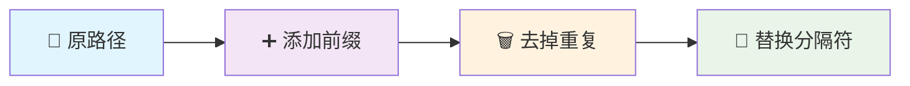

import Tabs from '@theme/Tabs';
import TabItem from '@theme/TabItem';

# 🪞 反射系统

## 🌟 概述

UnrealCSharp 插件基于 **Unreal Engine 反射系统** 构建，能够根据[编辑器配置](../guides/configuration/editor)自动生成指定模块和插件下的各种类型绑定。

### � 支持的类型

| 类型 | 图标 | 描述 |
|------|------|------|
| **类 (Classes)** | 🏗️ | UObject、Actor 等 C++ 类 |
| **结构体 (Structs)** | 📦 | USTRUCT 标记的结构体 |
| **枚举 (Enums)** | 🔢 | UENUM 标记的枚举类型 |
| **资源类型 (Assets)** | 🎯 | 各种 UE 资源类型 |

:::tip 💡 核心优势
🔄 **无缝互操作**：C++ 和 C# 之间的完美桥接  
⚡ **实时同步**：反射类型变更自动同步  
🛡️ **类型安全**：编译时类型检查保障  
🚀 **高性能**：原生 UE 反射系统性能
:::

---

## 🧭 类型映射规则

UE 和 C# 两侧的反射类型存在 **一一对应关系**。对于复杂类型（如 UObject、蓝图等），需要理解 UE 中 **Package** 的概念。

:::note 📚 学习资源
📖 [UE4的资源管理 - 知乎专栏](https://zhuanlan.zhihu.com/p/357904199)  
🎥 [UE4资产管理基础 - Epic 官方直播](https://www.bilibili.com/video/BV1Mr4y1A7nZ)
:::

### 🔄 映射规则详解

<Tabs>

<TabItem value="C++" label="🔧 C++ 类型" default>

**🔧 转换规则**：去掉首位 `/`，将 `/` 替换为 `.`

```cpp title="💡 映射示例"
// 📍 C++ 类型路径
/Script/Engine.Actor

// ➡️ 映射后的 C# 命名空间
Script.Engine.Actor
```

**📋 常见映射示例**：

| 🎯 C++ 类型 | ➡️ | 🎯 C# 类型 |
|-------------|-----|------------|
| `AActor` | → | `Script.Engine.Actor` |
| `UObject` | → | `Script.CoreUObject.Object` |
| `FVector` | → | `Script.CoreUObject.Vector` |

</TabItem>

<TabItem value="blueprint" label="🎨 蓝图类型">

**🎨 转换规则**：添加 `Script/` 前缀，去掉重复的类名部分，将 `/` 替换为 `.`

```cpp title="💡 映射示例"
// 📍 蓝图类型路径
/Game/UnitTest/Reflection/BP_TestReflectionPropertyActor.BP_TestReflectionPropertyActor_C

// ➡️ 映射后的 C# 命名空间
Script.Game.UnitTest.Reflection.BP_TestReflectionPropertyActor_C
```

**🔄 转换步骤流程**：



| 步骤 | 内容 |
|------|------|
| 1️⃣ **原路径** | `/Game/UnitTest/Reflection/BP_TestReflectionPropertyActor.BP_TestReflectionPropertyActor_C` |
| 2️⃣ **添加前缀** | `Script/Game/UnitTest/Reflection/BP_TestReflectionPropertyActor.BP_TestReflectionPropertyActor_C` |
| 3️⃣ **去掉重复** | `Script/Game/UnitTest/Reflection/BP_TestReflectionPropertyActor_C` |
| 4️⃣ **替换分隔符** | `Script.Game.UnitTest.Reflection.BP_TestReflectionPropertyActor_C` |

</TabItem>

</Tabs>

---

## 📊 数据类型

针对不同的数据类型，插件提供了对应的映射机制，确保类型安全和性能优化。

:::info 🎯 设计理念
每种数据类型都经过精心设计，在保证功能完整性的同时，最大化性能表现。
:::

<Tabs>

<TabItem value="base" label="🔧 基本类型" default>

基本类型提供了 C++ 和 C# 之间的直接映射，确保最佳性能。

| 🎯 C++ 类型 | ➡️ | 🎯 C# 类型 | 📝 说明 |
|-------------|-----|------------|---------|
| `bool` | → | `bool` | 布尔值 |
| `int8` | → | `sbyte` | 8位有符号整数 |
| `int16` | → | `short` | 16位有符号整数 |
| `int32` | → | `int` | 32位有符号整数 |
| `int64` | → | `long` | 64位有符号整数 |
| `uint8` | → | `byte` | 8位无符号整数 |
| `uint16` | → | `ushort` | 16位无符号整数 |
| `uint32` | → | `uint` | 32位无符号整数 |
| `uint64` | → | `ulong` | 64位无符号整数 |
| `float` | → | `float` | 单精度浮点数 |
| `double` | → | `double` | 双精度浮点数 |

</TabItem>

<TabItem value="string" label="📝 字符串类型">

UE 提供了多种字符串类型，每种都有其特定的用途和性能特征。

| 🎯 C++ 类型 | ➡️ | 🎯 C# 类型 | 📝 用途 |
|-------------|-----|------------|---------|
| `FName` | → | `Script.CoreUObject.FName` | 🏷️ 标识符，内存优化 |
| `FText` | → | `Script.CoreUObject.FText` | 🌍 本地化文本显示 |
| `FString` | → | `Script.CoreUObject.FString` | 📄 通用字符串处理 |

:::tip 💡 选择建议
- **FName**：用于标识符、资源名称等不变字符串
- **FText**：用于用户界面显示文本，支持本地化
- **FString**：用于一般字符串操作和处理
:::

</TabItem>

<TabItem value="enum" label="🔢 枚举类型">

枚举类型（包括 `TEnumAsByte`）会自动映射到对应的 C# 枚举，保持类型安全。

<details>
<summary>💡 查看枚举映射示例</summary>

<Tabs>
<TabItem value="C++" label="🔧 C++ 定义" default>

```cpp title="ETestEnum.h"
UENUM(BlueprintType)
enum ETestEnum
{
	TestEnumZero,
	TestEnumOne,
	TestEnumTwo
};
```

</TabItem>

<TabItem value="C#" label="⚡ C# 映射">

```csharp title="ETestEnum.cs"
using Script.CoreUObject;

namespace Script.UnrealCSharpTest
{
	[PathName("/Script/UnrealCSharpTest.ETestEnum")]
	public enum ETestEnum : byte
	{
		TestEnumZero = 0,
		TestEnumOne = 1,
		TestEnumTwo = 2,
	}
}
```

</TabItem>
</Tabs>

:::note 📋 特点说明
✅ **自动生成**：基于 C++ 枚举自动生成  
✅ **类型安全**：编译时类型检查  
✅ **值对应**：枚举值完全一致  
✅ **属性标记**：包含路径名等元数据
:::

</details>

</TabItem>

<TabItem value="struct" label="📦 结构体类型">

结构体会生成完整的 C# 类，包含反射变量、静态结构体信息、构造函数和析构函数等。

<details>
<summary>💡 查看结构体映射示例</summary>

<Tabs>
<TabItem value="C++" label="🔧 C++ 定义" default>

```cpp title="FTestStruct.h"
USTRUCT(BlueprintType)
struct FTestStruct
{
	GENERATED_BODY()

	UPROPERTY(BlueprintReadWrite)
	int32 Value;
};
```

</TabItem>

<TabItem value="C#" label="⚡ C# 映射">

```csharp title="FTestStruct.cs"
using Script.Library;
using Script.CoreUObject;

namespace Script.UnrealCSharpTest
{
	[PathName("/Script/UnrealCSharpTest.TestStruct")]
	public partial class FTestStruct : IStaticStruct, IGarbageCollectionHandle
	{
		public static UScriptStruct StaticStruct()
		{
			return UStructImplementation.UStruct_StaticStructImplementation("/Script/UnrealCSharpTest.TestStruct");
		}

		public FTestStruct() => UStructImplementation.UStruct_RegisterImplementation(this, Utils.GetPathName(GetType()));

		~FTestStruct() => UStructImplementation.UStruct_UnRegisterImplementation(GarbageCollectionHandle);

		public static bool operator ==(FTestStruct A, FTestStruct B) => UStructImplementation.UStruct_IdenticalImplementation(StaticStruct().GarbageCollectionHandle, A?.GarbageCollectionHandle??nint.Zero, B?.GarbageCollectionHandle??nint.Zero);

		public static bool operator !=(FTestStruct A, FTestStruct B) => !UStructImplementation.UStruct_IdenticalImplementation(StaticStruct().GarbageCollectionHandle, A?.GarbageCollectionHandle??nint.Zero, B?.GarbageCollectionHandle??nint.Zero);

		public override bool Equals(object Other) => this == Other as FTestStruct;

		public override int GetHashCode() => (int)GarbageCollectionHandle;

		public int Value
		{
			get => FPropertyImplementation.FProperty_GetStructInt32PropertyImplementation(GarbageCollectionHandle, __Value);
			set => FPropertyImplementation.FProperty_SetStructInt32PropertyImplementation(GarbageCollectionHandle, __Value, value);
		}

		private static uint __Value = 0;

		public nint GarbageCollectionHandle { get; set; }
	}
}
```

</TabItem>
</Tabs>

:::note 🔧 功能特性
✅ **完整映射**：包含所有 UPROPERTY 变量  
✅ **内存管理**：自动处理生命周期  
✅ **运算符重载**：支持比较操作  
✅ **反射支持**：提供 StaticStruct 信息
:::

</details>

</TabItem>

<TabItem value="UObject" label="🏗️ UObject 类型">

UObject 类型会生成包含反射变量、反射函数、接口函数和 StaticClass 等完整功能的 C# 类。

<details>
<summary>💡 查看 UObject 映射示例</summary>

<Tabs>
<TabItem value="C++" label="🔧 C++ 定义" default>

```cpp title="ATestReflectionPropertyActor.h"
#pragma once

#include "CoreMinimal.h"
#include "GameFramework/Actor.h"
#include "UnitTest/Core/TestInterface.h"
#include "TestReflectionPropertyActor.generated.h"

UCLASS()
class UNREALCSHARPTEST_API ATestReflectionPropertyActor : public AActor, public ITestInterface
{
	GENERATED_BODY()

public:
	// Sets default values for this actor's properties
	ATestReflectionPropertyActor();

public:
	UPROPERTY(BlueprintReadWrite)
	int32 Int32Value;
};
```

</TabItem>

<TabItem value="C#" label="⚡ C# 映射">

```csharp title="ATestReflectionPropertyActor.cs"
using Script.Engine;
using Script.CoreUObject;
using Script.Library;

namespace Script.UnrealCSharpTest
{
    [PathName("/Script/UnrealCSharpTest.TestReflectionPropertyActor")]
    public partial class ATestReflectionPropertyActor : AActor, IStaticClass, ITestInterface
    {
        public int Int32Value
        {
            get => FPropertyImplementation.FProperty_GetObjectInt32PropertyImplementation(GarbageCollectionHandle， __Int32Value);
            set => FPropertyImplementation.FProperty_SetObjectInt32PropertyImplementation(GarbageCollectionHandle， __Int32Value, value);
        }

        public new static UClass StaticClass()
        {
            return UObjectImplementation.UObject_StaticClassImplementation("/Script/UnrealCSharpTest.TestReflectionPropertyActor");
        }

        private static uint __Int32Value = 0;
    }
}
```

</TabItem>
</Tabs>

:::note 🎯 核心特性
✅ **继承关系**：完整保持 C++ 的继承链  
✅ **接口支持**：自动实现所有接口  
✅ **属性访问**：Properties 方式访问变量  
✅ **静态信息**：提供 StaticClass 反射信息
:::

</details>

</TabItem>

<TabItem value="UObject template" label="🔗 模板类型">

UE 的模板类型提供了类型安全的泛型支持，在 C# 中映射为对应的泛型类。

| 🎯 C++ 模板类型 | ➡️ | 🎯 C# 泛型类型 | 📝 用途 |
|-----------------|-----|----------------|---------|
| `TScriptInterface<T>` | → | `Script.CoreUObject.TScriptInterface<T>` | 🔌 接口引用 |
| `TSubclassOf<T>` | → | `Script.CoreUObject.TSubclassOf<T>` | 🏷️ 类类型引用 |
| `TWeakObjectPtr<T>` | → | `Script.CoreUObject.TWeakObjectPtr<T>` | 🔗 弱引用指针 |
| `TLazyObjectPtr<T>` | → | `Script.CoreUObject.TLazyObjectPtr<T>` | ⏳ 延迟加载指针 |
| `TSoftObjectPtr<T>` | → | `Script.CoreUObject.TSoftObjectPtr<T>` | 💾 软引用指针 |
| `TSoftClassPtr<T>` | → | `Script.CoreUObject.TSoftClassPtr<T>` | 🏗️ 软类引用 |
| `TOptional<T>` | → | `Script.CoreUObject.TOptional<T>` | ❓ 可选值类型 |

:::tip 💡 使用建议
- **TWeakObjectPtr**：避免循环引用的安全选择
- **TSoftObjectPtr**：异步加载资源的最佳实践
- **TOptional**：表示可能为空的值，增强代码健壮性
:::

</TabItem>

<TabItem value="container" label="📋 容器类型">

UE 的容器类型在 C# 中提供了对应的泛型集合实现。

| 🎯 C++ 容器 | ➡️ | 🎯 C# 泛型容器 | 📝 特性 |
|-------------|-----|----------------|---------|
| `TArray<T>` | → | `Script.CoreUObject.TArray<T>` | 📚 动态数组，高效随机访问 |
| `TSet<T>` | → | `Script.CoreUObject.TSet<T>` | 🎯 唯一元素集合，快速查找 |
| `TMap<K,V>` | → | `Script.CoreUObject.TMap<K,V>` | 🗂️ 键值对映射，高效关联 |

:::note 🚀 性能特点
- **TArray**：内存连续，缓存友好，适合频繁遍历
- **TSet**：哈希实现，O(1) 查找，适合去重和成员检测
- **TMap**：哈希表，快速键值查找，适合数据关联
:::

</TabItem>

<TabItem value="delegate" label="📡 委托类型">

UE 的单播和多播委托在 C# 中映射为对应的委托类，提供完整的事件处理机制。

<Tabs>
<TabItem value="single delegate" label="📡 单播委托" default>

单播委托适用于一对一的事件回调场景。

<details>
<summary>💡 查看单播委托示例</summary>

<Tabs>
<TabItem value="C++" label="🔧 C++ 声明" default>

```cpp title="FOnPointerEvent.h"
DECLARE_DYNAMIC_DELEGATE_RetVal_TwoParams(FEventReply, FOnPointerEvent, FGeometry, MyGeometry, const FPointerEvent&, MouseEvent);
```

</TabItem>

<TabItem value="C#" label="⚡ C# 映射">

```csharp title="FOnPointerEvent.cs"
using System;
using Script.CoreUObject;
using Script.Library;
using Script.SlateCore;
using Script.UMG;

namespace Script.UMG.Widget
{
	public class FOnPointerEvent : FDelegate<Func<FGeometry, FPointerEvent, FEventReply>>
	{
		public FOnPointerEvent() => FDelegateImplementation.FDelegate_RegisterImplementation(this);

		~FOnPointerEvent() => FDelegateImplementation.FDelegate_UnRegisterImplementation(GarbageCollectionHandle);

		public FEventReply Execute(FGeometry MyGeometry, FPointerEvent MouseEvent)
		{
			return FDelegateImplementation.FDelegate_Execute3Implementation(GarbageCollectionHandle, MyGeometry, MouseEvent) as FEventReply;
		}
	}
}
```

</TabItem>
</Tabs>

:::note 🎯 单播委托特点
✅ **类型安全**：强类型参数和返回值  
✅ **单一绑定**：一个委托只能绑定一个方法  
✅ **高性能**：直接调用，无需遍历  
✅ **返回值支持**：可以获取执行结果
:::

</details>

</TabItem>

<TabItem value="multicast delegate" label="📢 多播委托">

多播委托适用于一对多的事件广播场景。

<details>
<summary>💡 查看多播委托示例</summary>

<Tabs>
<TabItem value="C++" label="🔧 C++ 声明" default>

```cpp title="FOnButtonClickedEvent.h"
DECLARE_DYNAMIC_MULTICAST_DELEGATE(FOnButtonClickedEvent);
```

</TabItem>

<TabItem value="C#" label="⚡ C# 映射">

```csharp title="FOnButtonClickedEvent.cs"
using System;
using Script.CoreUObject;
using Script.Library;

namespace Script.UMG
{
	public class FOnButtonClickedEvent : FMulticastDelegate<Action>
	{
		public FOnButtonClickedEvent() => FMulticastDelegateImplementation.FMulticastDelegate_RegisterImplementation(this);

		~FOnButtonClickedEvent() => FMulticastDelegateImplementation.FMulticastDelegate_UnRegisterImplementation(GarbageCollectionHandle);

		public void Broadcast()
		{
			FMulticastDelegateImplementation.FMulticastDelegate_Broadcast0Implementation(GarbageCollectionHandle);
		}
	}
}
```

</TabItem>
</Tabs>

:::note 🎯 多播委托特点
✅ **多重绑定**：可以绑定多个方法  
✅ **广播机制**：一次调用触发所有绑定  
✅ **事件系统**：适合实现观察者模式  
✅ **动态管理**：运行时添加/移除绑定
:::

</details>

</TabItem>
</Tabs>

</TabItem>

</Tabs>

---

## 🔧 变量访问

反射变量在 C# 中以 **Properties**（属性）的形式呈现，而非 Fields（字段），这样可以确保数据的实际存储仍在 C++ 端，同时提供类型安全的访问接口。

:::info 🎯 设计理念
**Properties 设计**：确保数据完整性和性能最优  
**C++ 内存**：实际数据存储在 C++ 侧，避免数据同步问题  
**类型安全**：编译时检查，运行时保障
:::

<details>
<summary>💡 查看变量访问示例</summary>

<Tabs>
<TabItem value="C++" label="🔧 C++ 定义" default>

```cpp title="ATestReflectionPropertyActor.h"
#pragma once

#include "CoreMinimal.h"
#include "GameFramework/Actor.h"
#include "TestReflectionPropertyActor.generated.h"

UCLASS()
class UNREALCSHARPTEST_API ATestReflectionPropertyActor : public AActor
{
	GENERATED_BODY()

public:
	// Sets default values for this actor's properties
	ATestReflectionPropertyActor();

public:
	UPROPERTY(BlueprintReadWrite)
	int32 Int32Value;
};
```

</TabItem>

<TabItem value="C#" label="⚡ C# 使用">

```csharp title="PropertyAccessExample.cs"
using Script.CoreUObject;

namespace Script.UnrealCSharpTest
{
    public partial class UUnitTestSubsystem
    {
        private void TestReflectionProperty()
        {
            // 🎯 创建Actor实例
            var PropertyActor = GetWorld().SpawnActor<ATestReflectionPropertyActor>(new FTransform());

            // 📖 读取属性值
            var Int32Value = PropertyActor.Int32Value;

            // ✏️ 设置属性值
            PropertyActor.Int32Value = 21;

            // 🎉 属性访问完全类型安全！
        }
    }
}
```

</TabItem>
</Tabs>

:::note 💡 访问特点
✅ **智能提示**：VS Code/Visual Studio 完整支持  
✅ **类型检查**：编译时验证类型匹配  
✅ **性能优化**：直接访问 C++ 内存  
✅ **调试友好**：可在调试器中查看值
:::

</details>

---

## ⚡ 函数调用

C++ 和蓝图中的反射函数会自动生成对应的 C# 方法，包括完整的参数处理、默认值支持和返回值处理。

:::tip 🚀 功能亮点
**自动映射**：无需手动绑定，自动生成调用代码  
**参数支持**：完整支持输入、输出、引用参数  
**默认值**：保持 C++ 函数的默认参数行为  
**异常安全**：提供完整的错误处理机制
:::

<details>
<summary>💡 查看函数调用示例</summary>

<Tabs>
<TabItem value="C++" label="🔧 C++ 定义" default>

```cpp title="ATestReflectionFunctionActor.h"
#pragma once

#include "CoreMinimal.h"
#include "GameFramework/Actor.h"
#include "TestReflectionFunctionActor.generated.h"

UCLASS()
class UNREALCSHARPTEST_API ATestReflectionFunctionActor : public AActor
{
	GENERATED_BODY()

public:
	// Sets default values for this actor's properties
	ATestReflectionFunctionActor();

public:
	UFUNCTION(BlueprintCallable)
	void SetInt32ValueFunction(int32 InInt32Value);

	UFUNCTION(BlueprintCallable)
	int32 GetInt32ValueFunction() const;

	UFUNCTION(BlueprintCallable)
	void OutInt32ValueFunction(int32& OutInt32Value) const;
};
```

</TabItem>

<TabItem value="C#" label="⚡ C# 调用">

```csharp title="FunctionCallExample.cs"
using Script.CoreUObject;
using Script.Engine;

namespace Script.UnrealCSharpTest
{
    public partial class UUnitTestSubsystem
    {
        private void TestReflectionFunction()
        {
            // 🎯 创建函数测试Actor
            var FunctionActor = GetWorld().SpawnActor<ATestReflectionFunctionActor>(new FTransform());

            // 📖 调用获取函数（返回值）
            var Int32Value = FunctionActor.GetInt32ValueFunction();

            // ✏️ 调用设置函数（输入参数）
            FunctionActor.SetInt32ValueFunction(21);

            // 🔄 调用输出函数（引用参数）
            var OutInt32Value = 12;
            FunctionActor.OutInt32ValueFunction(ref OutInt32Value);
            // OutInt32Value 现在包含函数输出的值
        }
    }
}
```

</TabItem>
</Tabs>

:::note 🎯 调用特点
✅ **完整映射**：支持所有 UFUNCTION 函数  
✅ **参数类型**：输入、输出、引用参数完整支持  
✅ **返回值**：正确处理各种返回类型  
✅ **异步支持**：对于异步函数提供 async/await 支持
:::

</details>

---

## 🎉 总结

UnrealCSharp 的反射系统为 C++ 和 C# 之间搭建了一座无缝的桥梁：

| 🎯 核心特性 | 📝 说明 | 🚀 优势 |
|-------------|---------|---------|
| **自动生成** | 基于 UE 反射自动生成绑定 | 无需手动维护绑定代码 |
| **类型安全** | 编译时类型检查 | 减少运行时错误 |
| **高性能** | 直接访问 C++ 内存 | 接近原生性能 |
| **完整支持** | 涵盖所有 UE 反射类型 | 功能无缺失 |

:::tip 🎯 最佳实践
1. **充分利用**：使用 IntelliSense 提高开发效率
2. **类型检查**：依赖编译器捕获类型错误
3. **性能考虑**：大量数据处理时注意内存布局
4. **调试技巧**：使用混合模式调试追踪 C++/C# 调用栈
:::
