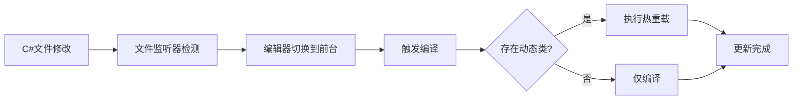

# 编辑器热重载

UnrealCSharp提供强大的热重载功能，支持C#代码和UE资源的实时更新，大幅提升开发效率。

## 🔄 C#文件热重载

### 工作机制

UnrealCSharp使用`IDirectoryWatcher::FDirectoryChanged`监听Script项目中Game工程的C#文件变更，实现以下流程：



### 触发条件

| 条件 | 说明 |
|------|------|
| **文件变更** | C#源文件被修改、添加或删除 |
| **编辑器激活** | UE编辑器窗口获得焦点时检查变更 |
| **动态类检测** | 变更列表中包含可热重载的动态类 |

### 监听范围

- **监听目录**: `Script/Game/` 项目目录
- **文件类型**: `.cs` C#源代码文件
- **排除项**: 临时文件、备份文件等

### 配置参数

在Editor配置中控制热重载行为：

```json
{
  "Generator": {
    "bEnableDirectoryChanged": true,    // 启用C#文件监听
    "bEnableCompiled": true             // 启用自动编译
  }
}
```

:::tip 性能优化
- 大型项目建议使用增量编译
- 可通过配置排除不需要监听的目录
- 建议在SSD上存放项目文件以提升编译速度
:::

---

## 🎨 资源热重载

### 支持的资源操作

UnrealCSharp监听以下UE资源变更操作：

| 操作类型 | 描述 | 触发行为 |
|----------|------|----------|
| **新增** | 创建新的蓝图、结构体等资源 | 生成对应C#绑定文件 |
| **删除** | 删除现有资源 | 移除对应C#文件 |
| **修改** | 更新资源内容（如添加变量） | 重新生成C#绑定 |
| **重命名** | 资源重命名或移动 | 更新C#文件名和命名空间 |

### 资源类型支持

根据[Editor配置](../guides/configuration/editor#supportedassetclass支持的资源类型)，默认支持：

#### 完整绑定（变量+函数）
- **Blueprint** - 蓝图类
- **WidgetBlueprint** - UI蓝图

#### 变量绑定
- **UserDefinedStruct** - 用户定义结构体

#### 枚举绑定  
- **UserDefinedEnum** - 用户定义枚举

#### 类型引用
- **其他资源类型** - 生成空类以防止硬编码

### 配置示例

```json
{
  "Generator": {
    "bEnableAssetChanged": true,
    "bIsGenerateAsset": true,
    "SupportedAssetPath": ["MyProject"],
    "SupportedAssetClass": [
      "Blueprint",
      "UserDefinedStruct", 
      "UserDefinedEnum",
      "WidgetBlueprint"
    ]
  }
}
```

### 生成规则

当资源变更时，系统会：

1. **检查资源类型**: 是否在`SupportedAssetClass`列表中
2. **验证路径**: 资源是否属于`SupportedAssetPath`指定的模块
3. **生成C#代码**: 创建或覆盖对应的C#绑定文件
4. **触发编译**: 自动编译更新后的代码

:::info 命名规则
- C#类名与UE资源名保持一致
- 命名空间根据资源路径自动生成
- 特殊字符会被自动转换为有效的C#标识符
:::

---

## ⚡ 性能优化

### 编译优化

| 策略 | 说明 | 效果 |
|------|------|------|
| **增量编译** | 仅编译变更的文件 | 显著减少编译时间 |
| **并行编译** | 多线程编译支持 | 充分利用多核CPU |
| **缓存机制** | 缓存编译结果 | 避免重复编译 |

### 监听优化

```json
{
  "Generator": {
    "bIsSkipGenerateEngineModules": true,  // 跳过引擎模块重复生成
    "bIsGenerateAllModules": false,        // 使用自定义模块列表
    "SupportedModule": ["MyProject"]       // 仅监听项目模块
  }
}
```

### 文件系统优化

- **SSD存储**: 将项目存放在SSD上
- **排除监听**: 排除临时文件和缓存目录
- **合理分组**: 按功能模块组织代码结构

---

## 🚨 注意事项

### 限制条件

- **静态类限制**: 某些静态绑定类型无法热重载
- **内存引用**: 已创建的对象实例不会自动更新
- **依赖关系**: 类型依赖变更可能需要重启编辑器

### 最佳实践

1. **及时保存**: 修改后及时保存文件以触发热重载
2. **避免循环依赖**: 设计时避免复杂的类型依赖关系
3. **测试验证**: 热重载后及时测试功能是否正常
4. **备份重要代码**: 重要修改前建议备份代码

### 故障排除

| 问题 | 可能原因 | 解决方案 |
|------|----------|----------|
| 热重载失败 | 编译错误 | 检查编译输出，修复语法错误 |
| 变更未生效 | 缓存问题 | 重启编辑器或清理缓存 |
| 性能下降 | 频繁重载 | 优化代码结构，减少不必要的变更 |

:::warning 重要提醒
热重载功能主要用于开发阶段，打包发布时会使用完整编译流程以确保稳定性。
:::

---
